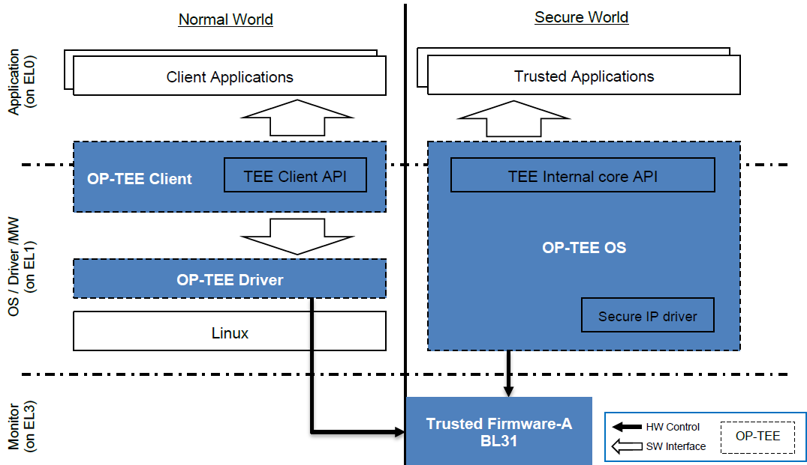
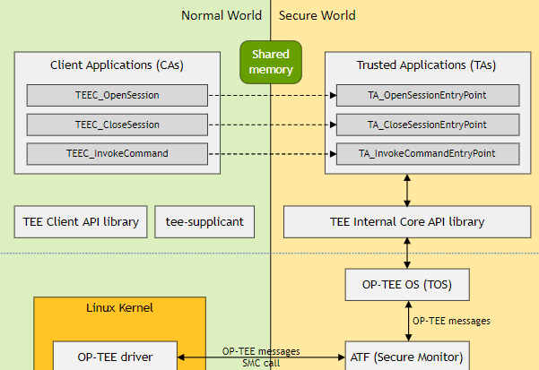

### Note on OP-TEE OS
This is the application note on OPTEE-OS that will be helpful for someone who wants to develop the trusted application
### OP-TEE
Open Portable Trusted Execution Environment (OPTEE) is an open-source Trusted Execution Environment (TEE) based on Arm TrustZone.
OP-TEE combines with two major components: OPTEE OS which is the trusted side of the TEE (secure world) and OPTEE Client, which is 
the untrusted or normal side of the TEE (normal world)

#### OPTEE OS :
OPTEE OS is a Trusted OS that uses ARM TrustZone technology and provides
the TEE internal core API defined in the global platform API for the development of trusted applications.
You can use this API to build Trusted Applications (TA) that run in the secure world

#### OPTEE Client :
OP-TEE Client consists of the TEE Client library and TEE supplicant.
TEE Client library is a library that contains APIs defined by the GlobalPlatform TEE Standard.
This library is used by Clinet Application (CA) that are executed on Non-Trusted OS to communicate with the OP-TEE OS and TA.

### Pseudo Trusted Application(PTA) Vs User Mode Trusted Application(UTA)

#### Pseudo Trusted Application (PTA): 
- A Pseudo Trusted Application (PTA) is a special type of trusted application that operates within the trusted execution environment
- They interact directly with the secure resources and services provided by the TEE OS.
- They often provide low-level secure functionalities and services, such as cryptographic operations or secure storage access.

#### User Mode Trusted Application (UTA):
- A User Mode Trusted Application (UTA) is a trusted application that operates in the normal world (non-secure world) but 
interacts with secure resources and services provided by the trusted execution environment.
- They provide an interface between the normal world applications and the secure world, facilitating access to secure functionalities.

#### Trusted Application (TA) and Client Application (CA)

The OP-TEE TA/CA is a client-server model that follows the GlobalPlatform TEE API. 
The Client Application uses the TEE Client API to invoke the Trusted Application service in the secure world. 
The Trusted Application implements the functions defined by TEE Internal Core API Specification.

 

* A client application (CA) sends a request to a trusted application (TA) by calling functions in the TEE Client API
* The TEE Client API library routes the request to the OP-TEE Linux Kernel Driver
* The OP-TEE Linux Driver routes the client application request to Arm Trusted Firmware (ATF)
* The OP-TEE OS framework determines which trusted application (TA) is to handle the request.
* The OP-TEE OS framework passes control to the TA to handle the request
* Upon completion, execution control returns to the client application,
  which receives a return value and any processed data

